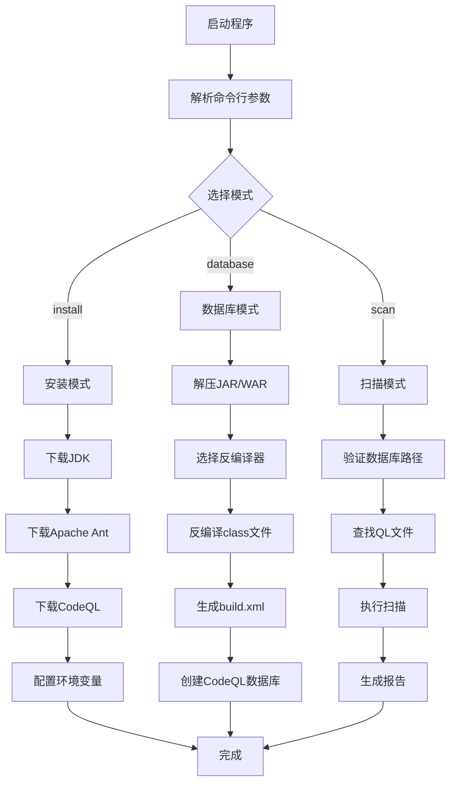
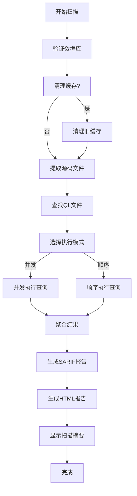
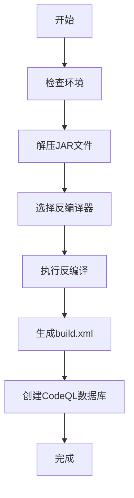

# CodeQL N1ght 详细技术文档

## 📋 目录

- [项目概述](#项目概述)
- [系统架构](#系统架构)
- [核心模块详解](#核心模块详解)
- [API 文档](#api-文档)
- [配置管理](#配置管理)
- [工作流程](#工作流程)
- [扩展开发](#扩展开发)
- [MCP 服务集成准备](#mcp-服务集成准备)
- [故障排除](#故障排除)
- [性能优化](#性能优化)

## 项目概述

### 🎯 项目目标

CodeQL N1ght 是一个专业的 CodeQL 数据库自动化创建和安全扫描工具，旨在简化 Java 应用程序的静态安全分析流程。项目支持从 JAR/WAR 包自动生成 CodeQL 数据库，并提供完整的扫描和报告功能。

### ✨ 核心特性

1. **自动化环境配置**：一键安装 JDK、Apache Ant、CodeQL 等必要工具
2. **智能反编译引擎**：支持多种反编译器（Procyon、Fernflower）
3. **多格式支持**：处理 JAR、WAR、ZIP 格式的 Java 应用
4. **并发处理能力**：支持 Goroutine 并发反编译和扫描
5. **安全扫描引擎**：集成 CodeQL 扫描功能，支持自定义查询规则
6. **多格式报告生成**：生成 SARIF 格式和 HTML 可视化报告
7. **灵活配置系统**：支持自定义下载源、反编译器选择、扫描参数等
8. **缓存管理**：智能缓存清理，确保查询文件修改后生效
9. **源码提取**：自动从数据库提取源码文件用于分析

### 🏗️ 技术栈

- **编程语言**：Go 1.22.0+
- **依赖管理**：Go Modules
- **外部工具**：CodeQL CLI、Apache Ant、JDK
- **反编译器**：Procyon、Fernflower
- **报告格式**：SARIF、HTML

## 系统架构

### 🔧 整体架构图

```
┌─────────────────────────────────────────────────────────────┐
│                    CodeQL N1ght 系统架构                      │
├─────────────────────────────────────────────────────────────┤
│  CLI Interface (main.go)                                   │
├─────────────────┬─────────────────┬─────────────────────────┤
│   Common 模块    │   Install 模块   │   Database 模块          │
│  ┌─────────────┐ │  ┌─────────────┐ │  ┌─────────────────────┐ │
│  │ Config.go   │ │  │ JDKDownload │ │  │ Builder.go          │ │
│  │ Flag.go     │ │  │ AntDownload │ │  │ Decompiler.go       │ │
│  │Environment  │ │  │CodeQLDownload│ │  │ Initializer.go      │ │
│  │ Utils.go    │ │  │DecompileDown│ │  │ Utils.go            │ │
│  │CommandExec  │ │  │TomcatDownload│ │  │ Decompile.go        │ │
│  │ Start.go    │ │  │ Utils.go    │ │  │                     │ │
│  └─────────────┘ │  └─────────────┘ │  └─────────────────────┘ │
├─────────────────┴─────────────────┴─────────────────────────┤
│                    Scanner 模块                              │
│  ┌─────────────────────────────────────────────────────────┐ │
│  │ Scanner.go │ cleanup.go │ file_extractor.go │ hints.go  │ │
│  │           html_report.go                                │ │
│  └─────────────────────────────────────────────────────────┘ │
├─────────────────────────────────────────────────────────────┤
│                    外部工具集成                               │
│  ┌─────────────┐ ┌─────────────┐ ┌─────────────────────────┐ │
│  │   JDK       │ │ Apache Ant  │ │      CodeQL CLI         │ │
│  │             │ │             │ │   + QL Libraries        │ │
│  └─────────────┘ └─────────────┘ └─────────────────────────┘ │
├─────────────────────────────────────────────────────────────┤
│                    输出文件                                   │
│  ┌─────────────┐ ┌─────────────┐ ┌─────────────────────────┐ │
│  │results.sarif│ │scan_report  │ │    CodeQL Database      │ │
│  │             │ │   .html     │ │                         │ │
│  └─────────────┘ └─────────────┘ └─────────────────────────┘ │
└─────────────────────────────────────────────────────────────┘
```

### 📦 模块依赖关系

```
main.go
├── Common/
│   ├── Config.go (全局配置)
│   ├── Flag.go (命令行解析)
│   ├── Environment.go (环境设置)
│   ├── Utils.go (工具函数)
│   ├── Start.go (启动界面)
│   └── CommandExecutor.go (命令执行器)
├── Install/
│   ├── JDKDownload.go
│   ├── AntDownload.go
│   ├── CodeqlDownload.go
│   ├── DecompileDownload.go
│   ├── TomcatDownload.go
│   └── Utils.go
├── Database/
│   ├── Builder.go (数据库构建)
│   ├── Decompiler.go (反编译引擎)
│   ├── Decompile.go (反编译入口)
│   ├── Initializer.go (初始化流程)
│   └── Utils.go
└── Scanner/
    ├── Scanner.go (扫描引擎核心)
    ├── cleanup.go (清理工具)
    ├── file_extractor.go (文件提取器)
    ├── hints.go (扫描提示)
    └── html_report.go (HTML报告生成)
```

## 核心模块详解

### 🔧 Common 模块

#### Config.go - 全局配置管理

```go
// 核心配置变量
var (
    IsInstall       bool   // 安装模式标志
    CreateJar       string // 数据库创建目标文件
    DecompilerType  string // 反编译器类型
    ScanMode        bool   // 扫描模式标志
    DatabasePath    string // 数据库路径
    QLLibsPath      string // QL库路径
    // ... 更多配置项
)
```

**功能说明**：
- 管理全局配置变量
- 支持运行时配置修改
- 提供配置验证机制

#### Flag.go - 命令行参数解析

**支持的参数类型**：

| 参数类别 | 参数名 | 类型 | 说明 |
|---------|--------|------|------|
| 主功能 | `-install` | bool | 一键安装环境 |
| 主功能 | `-database` | string | 创建数据库 |
| 主功能 | `-scan` | bool | 扫描模式 |
| 安装配置 | `-jdk` | string | JDK下载地址 |
| 安装配置 | `-ant` | string | Ant下载地址 |
| 安装配置 | `-codeql` | string | CodeQL下载地址 |
| 扫描配置 | `-db` | string | 数据库路径 |
| 扫描配置 | `-ql` | string | QL库路径 |
| 通用配置 | `-decompiler` | string | 反编译器选择 |
| 性能配置 | `-goroutine` | bool | 启用并发 |
| 性能配置 | `-threads` | int | 线程数 |

#### Environment.go - 环境变量管理

**核心功能**：
```go
func SetupEnvironment() error {
    // 1. 设置JDK环境变量
    setupJDKEnvironment(toolsDir)
    
    // 2. 设置CodeQL环境变量
    setupCodeQLEnvironment(toolsDir)
    
    // 3. 设置Ant环境变量
    setupAntEnvironment(toolsDir)
    
    // 4. 更新系统PATH
    addToPath(newPath)
}
```

### 🛠️ Install 模块

#### 下载管理器架构

```go
type DownloadManager interface {
    Download(url, destination string) error
    Verify(path string) error
    Extract(archive, destination string) error
}
```

**各下载器实现**：

1. **JDKDownload.go**
   - 支持多平台JDK下载
   - 自动检测系统架构
   - 验证JDK完整性

2. **CodeqlDownload.go**
   - CodeQL CLI下载和配置
   - 版本兼容性检查
   - 自动PATH配置

3. **AntDownload.go**
   - Apache Ant下载和安装
   - 构建脚本生成
   - 环境变量配置

### 🗄️ Database 模块

#### Builder.go - 数据库构建引擎

**核心构建流程**：

```go
func Createdatabase(location string) {
    // 1. 环境准备
    Common.SetupEnvironment()
    
    // 2. 构建CodeQL命令
    cmd := exec.Command(
        "codeql",
        "database", "create", "temp",
        "--language=java",
        "--command=ant -f build.xml",
        "--source-root", "./",
        "--overwrite",
        "--ram=51200",
        "--threads="+strconv.Itoa(Common.CodeQLThreads),
    )
    
    // 3. 执行构建
    executeWithStreaming(cmd)
}
```

**构建参数说明**：
- `--language=java`: 指定Java语言
- `--command=ant -f build.xml`: 使用Ant构建
- `--ram=51200`: 分配51GB内存
- `--threads=N`: 并发线程数

#### Decompiler.go - 反编译引擎

**支持的反编译器**：

1. **Procyon反编译器**
   ```go
   func decompileWithProcyon(jarFile, outputDir string) error {
       args := []string{
           "-jar", "tools/java-decompiler.jar",
           "-o", outputDir,
           jarFile,
       }
       return DecompileJava(args...)
   }
   ```

2. **Fernflower反编译器**
   ```go
   func decompileWithFernflower(jarFile, outputDir string) error {
       args := []string{
           "-jar", "tools/fernflower.jar",
           "-dgs=1", "-hdc=0", "-asc=1",
           jarFile, outputDir,
       }
       return DecompileJava(args...)
   }
   ```

**并发反编译支持**：
```go
func decompileWithGoroutines(selectedFiles, jarFiles []string, location string) {
    semaphore := make(chan struct{}, Common.MaxGoroutines)
    var wg sync.WaitGroup
    
    for _, jarFile := range jarFiles {
        wg.Add(1)
        go func(jar string) {
            defer wg.Done()
            semaphore <- struct{}{} // 获取信号量
            defer func() { <-semaphore }() // 释放信号量
            
            // 执行反编译
            decompileJarFile(jar, outputDir, selectedFile)
        }(jarFile)
    }
    
    wg.Wait()
}
```

### 🔍 Scanner 模块

#### 主要功能
- CodeQL 查询执行（顺序/并发模式）
- 源码文件自动提取
- 扫描结果处理和聚合
- 多格式报告生成（SARIF + HTML）
- 缓存管理和清理
- 扫描进度监控

#### 核心文件
- `Scanner.go`：扫描引擎核心，包含主要扫描逻辑
- `cleanup.go`：缓存清理工具，确保查询文件修改生效
- `file_extractor.go`：源码文件提取器，从数据库提取源码
- `hints.go`：扫描提示和进度显示
- `html_report.go`：HTML报告生成器，创建可视化报告

#### Scanner.go - 扫描引擎

**扫描结果结构**：
```go
type ScanResult struct {
    QueryFile string        // 查询文件路径
    Success   bool          // 扫描是否成功
    Output    string        // 扫描输出
    Error     error         // 错误信息
    Duration  time.Duration // 执行时间
}
```

**并发扫描实现**：
```go
func executeConcurrentQueries(qlFiles []string) []ScanResult {
    results := make([]ScanResult, len(qlFiles))
    var wg sync.WaitGroup
    
    for i, qlFile := range qlFiles {
        wg.Add(1)
        go func(index int, file string) {
            defer wg.Done()
            results[index] = executeQuery(file)
        }(i, qlFile)
    }
    
    wg.Wait()
    return results
}
```

**关键函数**：
```go
// 主扫描函数
func RunScan() error

// 并发查询执行
func runQueriesConcurrently(qlFiles []string) []ScanResult

// 顺序查询执行
func runQueriesSequentially(qlFiles []string) []ScanResult

// 扫描结果聚合
func aggregateResults(results []ScanResult) *ScanSummary
```

#### html_report.go - 报告生成器

**HTML报告特性**：
- 响应式设计
- 交互式结果展示
- 漏洞严重性分级
- 代码高亮显示
- 导出功能

## API 文档

### 🔌 核心API接口

#### Scanner包API

```go
// 扫描执行API
func RunScan() error
func ExecuteConcurrentQueries(qlFiles []string) []ScanResult
func ExecuteSequentialQueries(qlFiles []string) []ScanResult
func runQueriesConcurrently(qlFiles []string) []ScanResult
func runQueriesSequentially(qlFiles []string) []ScanResult

// 文件管理API
func ExtractSourceFiles() error
func CleanupPreviousResults() error
func FindQLFiles() ([]string, error)
func CleanupCache() error

// 报告生成API
func GenerateHTMLReport(results []ScanResult) error
func GenerateSARIFReport(results []ScanResult) error
func DisplayScanSummary(results []ScanResult)
func aggregateResults(results []ScanResult) *ScanSummary
```

#### Common包API

```go
// 日志记录API
func LogInfo(format string, args ...interface{})
func LogWarn(format string, args ...interface{})
func LogError(format string, args ...interface{})

// 环境管理API
func SetupEnvironment() error
func GetToolVersions() map[string]string
func PrintToolVersions()

// 命令执行API
func ExecuteCommand(name string, args ...string) error
func ExecuteCommandWithOutput(name string, args ...string) (string, error)
```

#### Install包API

```go
// 工具安装API
func InstallJDK(downloadURL string) error
func InstallAnt(downloadURL string) error
func InstallCodeQL(downloadURL string) error
func InstallDecompiler() error

// 下载管理API
func DownloadFile(url, destination string) error
func ExtractArchive(archive, destination string) error
func VerifyInstallation(toolName string) bool
```

#### Database包API

```go
// 数据库创建API
func Createdatabase(location string)
func GenerateBuildXML(location string) error
func InitializeDatabase(jarPath string) error

// 反编译API
func DecompileJava(args ...string) error
func DecompileLibraries(location string)
func ExtractJar(jarFile, destDir string) error

// 反编译器选择API
func decompileWithProcyon(jarFile, outputDir string) error
func decompileWithFernflower(jarFile, outputDir string) error
```

### 🔧 配置API

```go
// 配置管理接口
type Config interface {
    Get(key string) interface{}
    Set(key string, value interface{}) error
    Validate() error
    Save() error
    Load() error
}

// 实现示例
type AppConfig struct {
    settings map[string]interface{}
}

func (c *AppConfig) Get(key string) interface{} {
    return c.settings[key]
}

func (c *AppConfig) Set(key string, value interface{}) error {
    c.settings[key] = value
    return c.Validate()
}
```

## 配置管理

### 📋 全局配置变量

```go
// Common/Config.go 中的主要配置
var (
    // 基础功能配置
    IsInstall       bool   // 安装模式标志
    CreateJar       string // 数据库创建目标文件
    DecompilerType  string // 反编译器类型
    
    // 扫描功能配置
    ScanMode        bool   // 扫描模式标志
    DatabasePath    string // 数据库路径
    QLLibsPath      string // QL库路径
    MaxGoroutines   int    // 最大并发数
    CodeQLThreads   int    // CodeQL线程数
    CleanCache      bool   // 是否清理缓存
    
    // 下载配置
    JDKDownloadURL        string
    CodeQLDownloadURL     string
    AntDownloadURL        string
    ProcyonDownloadURL    string
    FernflowerDownloadURL string
    TomcatDownloadURL     string
)
```

### 📋 配置文件结构

```yaml
# config.yaml (未来支持)
app:
  name: "CodeQL N1ght"
  version: "1.0.0"
  
tools:
  jdk:
    version: "11"
    download_url: "https://example.com/jdk-11.zip"
  ant:
    version: "1.10.12"
    download_url: "https://example.com/ant-1.10.12.zip"
  codeql:
    version: "latest"
    download_url: "https://github.com/github/codeql-cli-binaries/releases/latest"

decompiler:
  default: "procyon"
  options:
    - "procyon"
    - "fernflower"

performance:
  max_goroutines: 4
  codeql_threads: 20
  memory_limit: "51200MB"

scan:
  output_formats:
    - "sarif"
    - "html"
  concurrent_queries: true
  clean_cache: false
```

### 🔧 环境变量配置

```bash
# 工具路径配置
export CODEQL_N1GHT_TOOLS_DIR="/path/to/tools"
export CODEQL_N1GHT_JDK_HOME="/path/to/jdk"
export CODEQL_N1GHT_ANT_HOME="/path/to/ant"
export CODEQL_N1GHT_CODEQL_HOME="/path/to/codeql"

# 性能配置
export CODEQL_N1GHT_MAX_GOROUTINES="8"
export CODEQL_N1GHT_CODEQL_THREADS="32"
export CODEQL_N1GHT_MEMORY_LIMIT="102400"

# 下载配置
export CODEQL_N1GHT_JDK_URL="https://custom-jdk-url.com"
export CODEQL_N1GHT_PROXY="http://proxy.company.com:8080"
```

## 工作流程

### 🔄 完整工作流程图



### 🔍 安全扫描详细流程



### 🗄️ 数据库创建详细流程



### 📝 详细执行步骤

#### 1. 安装模式流程

```go
func installTools() error {
    steps := []struct {
        name string
        fn   func() error
    }{
        {"下载JDK", func() error { return Install.InstallJDK(Common.JDKDownloadURL) }},
        {"下载Apache Ant", func() error { return Install.InstallAnt(Common.AntDownloadURL) }},
        {"下载CodeQL", func() error { return Install.InstallCodeQL(Common.CodeQLDownloadURL) }},
        {"下载反编译器", func() error { return Install.InstallDecompiler() }},
        {"配置环境", func() error { return Common.SetupEnvironment() }},
    }
    
    for _, step := range steps {
        Common.LogInfo("执行步骤: %s", step.name)
        if err := step.fn(); err != nil {
            return fmt.Errorf("%s失败: %v", step.name, err)
        }
    }
    
    return nil
}
```

#### 2. 数据库创建流程

```go
func createDatabase() error {
    // 1. 初始化数据库创建环境
    if err := Database.InitializeDatabase(Common.CreateJar); err != nil {
        return fmt.Errorf("初始化失败: %v", err)
    }
    
    // 2. 解压和反编译
    location := filepath.Dir(Common.CreateJar)
    Database.DecompileLibraries(location)
    
    // 3. 生成构建文件
    if err := Database.GenerateBuildXML(location); err != nil {
        return fmt.Errorf("生成构建文件失败: %v", err)
    }
    
    // 4. 创建CodeQL数据库
    Database.Createdatabase(location)
    
    return nil
}
```

#### 3. 扫描模式流程

```go
func runScan() error {
    // 1. 验证扫描环境
    if err := Scanner.ValidateScanDirectory(); err != nil {
        return fmt.Errorf("扫描环境验证失败: %v", err)
    }
    
    // 2. 执行扫描
    if err := Scanner.RunScan(); err != nil {
        return fmt.Errorf("扫描执行失败: %v", err)
    }
    
    return nil
}
```

## 扩展开发

### 🔌 插件系统设计

```go
// 插件接口定义
type Plugin interface {
    Name() string
    Version() string
    Initialize() error
    Execute(context *PluginContext) error
    Cleanup() error
}

// 插件上下文
type PluginContext struct {
    Config    map[string]interface{}
    Logger    Logger
    Database  DatabaseManager
    Scanner   ScannerManager
}

// 插件管理器
type PluginManager struct {
    plugins map[string]Plugin
    config  *Config
}

func (pm *PluginManager) RegisterPlugin(plugin Plugin) error {
    if err := plugin.Initialize(); err != nil {
        return fmt.Errorf("插件初始化失败: %v", err)
    }
    
    pm.plugins[plugin.Name()] = plugin
    return nil
}

func (pm *PluginManager) ExecutePlugin(name string, context *PluginContext) error {
    plugin, exists := pm.plugins[name]
    if !exists {
        return fmt.Errorf("插件不存在: %s", name)
    }
    
    return plugin.Execute(context)
}
```

### 🔧 自定义反编译器

```go
// 反编译器接口
type Decompiler interface {
    Name() string
    SupportedFormats() []string
    Decompile(input, output string, options DecompileOptions) error
}

// 反编译选项
type DecompileOptions struct {
    Concurrent    bool
    MaxWorkers    int
    OutputFormat  string
    DebugMode     bool
    CustomArgs    []string
}

// 自定义反编译器示例
type CustomDecompiler struct {
    name       string
    executable string
}

func (cd *CustomDecompiler) Name() string {
    return cd.name
}

func (cd *CustomDecompiler) SupportedFormats() []string {
    return []string{".jar", ".war", ".class"}
}

func (cd *CustomDecompiler) Decompile(input, output string, options DecompileOptions) error {
    args := []string{"-jar", cd.executable}
    args = append(args, options.CustomArgs...)
    args = append(args, input, output)
    
    return Common.ExecuteCommand("java", args...)
}
```

### 📊 自定义扫描规则

```go
// 扫描规则接口
type ScanRule interface {
    ID() string
    Name() string
    Description() string
    Severity() Severity
    Execute(context *ScanContext) (*ScanResult, error)
}

// 扫描上下文
type ScanContext struct {
    DatabasePath string
    SourcePath   string
    Config       map[string]interface{}
    Logger       Logger
}

// 严重性级别
type Severity int

const (
    SeverityInfo Severity = iota
    SeverityLow
    SeverityMedium
    SeverityHigh
    SeverityCritical
)

// 自定义规则示例
type SQLInjectionRule struct{}

func (r *SQLInjectionRule) ID() string {
    return "sql-injection-001"
}

func (r *SQLInjectionRule) Name() string {
    return "SQL注入检测"
}

func (r *SQLInjectionRule) Description() string {
    return "检测潜在的SQL注入漏洞"
}

func (r *SQLInjectionRule) Severity() Severity {
    return SeverityHigh
}

func (r *SQLInjectionRule) Execute(context *ScanContext) (*ScanResult, error) {
    // 实现具体的扫描逻辑
    qlQuery := `
        import java
        from Method m
        where m.getName() = "executeQuery"
        select m, "Potential SQL injection"
    `
    
    return executeCodeQLQuery(context.DatabasePath, qlQuery)
}
```

## MCP 服务集成准备

### 🔗 MCP 架构设计

Model Context Protocol (MCP) 是一个用于AI模型与外部工具集成的标准协议。为CodeQL N1ght添加MCP支持将使其能够与AI助手无缝集成。

#### MCP 服务器结构

```go
// MCP服务器接口
type MCPServer interface {
    Start() error
    Stop() error
    RegisterTool(tool MCPTool) error
    HandleRequest(request *MCPRequest) (*MCPResponse, error)
}

// MCP工具接口
type MCPTool interface {
    Name() string
    Description() string
    Schema() *ToolSchema
    Execute(params map[string]interface{}) (*ToolResult, error)
}

// 工具模式定义
type ToolSchema struct {
    Type       string                 `json:"type"`
    Properties map[string]interface{} `json:"properties"`
    Required   []string               `json:"required"`
}

// 工具执行结果
type ToolResult struct {
    Success bool        `json:"success"`
    Data    interface{} `json:"data,omitempty"`
    Error   string      `json:"error,omitempty"`
}
```

#### 预定义MCP工具

1. **数据库创建工具**
```go
type DatabaseCreationTool struct{}

func (t *DatabaseCreationTool) Name() string {
    return "create_codeql_database"
}

func (t *DatabaseCreationTool) Description() string {
    return "从JAR/WAR文件创建CodeQL数据库"
}

func (t *DatabaseCreationTool) Schema() *ToolSchema {
    return &ToolSchema{
        Type: "object",
        Properties: map[string]interface{}{
            "file_path": map[string]interface{}{
                "type":        "string",
                "description": "JAR/WAR文件路径",
            },
            "decompiler": map[string]interface{}{
                "type":        "string",
                "enum":        []string{"procyon", "fernflower"},
                "description": "反编译器类型",
                "default":     "procyon",
            },
            "output_dir": map[string]interface{}{
                "type":        "string",
                "description": "输出目录路径",
            },
        },
        Required: []string{"file_path"},
    }
}

func (t *DatabaseCreationTool) Execute(params map[string]interface{}) (*ToolResult, error) {
    filePath, ok := params["file_path"].(string)
    if !ok {
        return &ToolResult{
            Success: false,
            Error:   "file_path参数必须是字符串",
        }, nil
    }
    
    // 设置配置
    Common.CreateJar = filePath
    if decompiler, exists := params["decompiler"]; exists {
        Common.DecompilerType = decompiler.(string)
    }
    
    // 执行数据库创建
    err := createDatabase()
    if err != nil {
        return &ToolResult{
            Success: false,
            Error:   err.Error(),
        }, nil
    }
    
    return &ToolResult{
        Success: true,
        Data: map[string]interface{}{
            "database_path": filepath.Join(filepath.Dir(filePath), "temp"),
            "message":       "数据库创建成功",
        },
    }, nil
}
```

2. **扫描执行工具**
```go
type ScanExecutionTool struct{}

func (t *ScanExecutionTool) Name() string {
    return "run_codeql_scan"
}

func (t *ScanExecutionTool) Description() string {
    return "执行CodeQL安全扫描"
}

func (t *ScanExecutionTool) Schema() *ToolSchema {
    return &ToolSchema{
        Type: "object",
        Properties: map[string]interface{}{
            "database_path": map[string]interface{}{
                "type":        "string",
                "description": "CodeQL数据库路径",
            },
            "query_path": map[string]interface{}{
                "type":        "string",
                "description": "查询文件或目录路径",
            },
            "output_format": map[string]interface{}{
                "type":        "string",
                "enum":        []string{"sarif", "html", "json"},
                "description": "输出格式",
                "default":     "sarif",
            },
            "concurrent": map[string]interface{}{
                "type":        "boolean",
                "description": "是否启用并发扫描",
                "default":     true,
            },
        },
        Required: []string{"database_path", "query_path"},
    }
}

func (t *ScanExecutionTool) Execute(params map[string]interface{}) (*ToolResult, error) {
    // 参数验证和设置
    databasePath := params["database_path"].(string)
    queryPath := params["query_path"].(string)
    
    Common.DatabasePath = databasePath
    Common.QLLibsPath = queryPath
    Common.ScanMode = true
    
    // 执行扫描
    err := runScan()
    if err != nil {
        return &ToolResult{
            Success: false,
            Error:   err.Error(),
        }, nil
    }
    
    return &ToolResult{
        Success: true,
        Data: map[string]interface{}{
            "scan_completed": true,
            "results_path":   "./results.sarif",
            "report_path":    "./scan_report.html",
        },
    }, nil
}
```

3. **环境安装工具**
```go
type EnvironmentSetupTool struct{}

func (t *EnvironmentSetupTool) Name() string {
    return "setup_environment"
}

func (t *EnvironmentSetupTool) Description() string {
    return "安装和配置CodeQL环境"
}

func (t *EnvironmentSetupTool) Execute(params map[string]interface{}) (*ToolResult, error) {
    // 设置安装模式
    Common.IsInstall = true
    
    // 如果提供了自定义下载URL，使用它们
    if jdkURL, exists := params["jdk_url"]; exists {
        Common.JDKDownloadURL = jdkURL.(string)
    }
    if antURL, exists := params["ant_url"]; exists {
        Common.AntDownloadURL = antURL.(string)
    }
    if codeqlURL, exists := params["codeql_url"]; exists {
        Common.CodeQLDownloadURL = codeqlURL.(string)
    }
    
    // 执行安装
    err := installTools()
    if err != nil {
        return &ToolResult{
            Success: false,
            Error:   err.Error(),
        }, nil
    }
    
    return &ToolResult{
        Success: true,
        Data: map[string]interface{}{
            "installation_completed": true,
            "tools_directory":        "./tools",
            "environment_configured": true,
        },
    }, nil
}
```

#### MCP服务器实现

```go
package mcp

import (
    "encoding/json"
    "fmt"
    "net/http"
    "log"
)

type CodeQLMCPServer struct {
    tools  map[string]MCPTool
    server *http.Server
}

func NewCodeQLMCPServer(port int) *CodeQLMCPServer {
    server := &CodeQLMCPServer{
        tools: make(map[string]MCPTool),
    }
    
    // 注册默认工具
    server.RegisterTool(&DatabaseCreationTool{})
    server.RegisterTool(&ScanExecutionTool{})
    server.RegisterTool(&EnvironmentSetupTool{})
    
    // 设置HTTP服务器
    mux := http.NewServeMux()
    mux.HandleFunc("/tools", server.handleToolsList)
    mux.HandleFunc("/tools/", server.handleToolExecution)
    
    server.server = &http.Server{
        Addr:    fmt.Sprintf(":%d", port),
        Handler: mux,
    }
    
    return server
}

func (s *CodeQLMCPServer) Start() error {
    log.Printf("启动MCP服务器，端口: %s", s.server.Addr)
    return s.server.ListenAndServe()
}

func (s *CodeQLMCPServer) RegisterTool(tool MCPTool) error {
    s.tools[tool.Name()] = tool
    log.Printf("注册MCP工具: %s", tool.Name())
    return nil
}

func (s *CodeQLMCPServer) handleToolsList(w http.ResponseWriter, r *http.Request) {
    if r.Method != http.MethodGet {
        http.Error(w, "Method not allowed", http.StatusMethodNotAllowed)
        return
    }
    
    tools := make([]map[string]interface{}, 0, len(s.tools))
    for _, tool := range s.tools {
        tools = append(tools, map[string]interface{}{
            "name":        tool.Name(),
            "description": tool.Description(),
            "schema":      tool.Schema(),
        })
    }
    
    response := map[string]interface{}{
        "tools": tools,
    }
    
    w.Header().Set("Content-Type", "application/json")
    json.NewEncoder(w).Encode(response)
}

func (s *CodeQLMCPServer) handleToolExecution(w http.ResponseWriter, r *http.Request) {
    if r.Method != http.MethodPost {
        http.Error(w, "Method not allowed", http.StatusMethodNotAllowed)
        return
    }
    
    // 解析工具名称
    toolName := r.URL.Path[len("/tools/"):]
    tool, exists := s.tools[toolName]
    if !exists {
        http.Error(w, "Tool not found", http.StatusNotFound)
        return
    }
    
    // 解析请求参数
    var params map[string]interface{}
    if err := json.NewDecoder(r.Body).Decode(&params); err != nil {
        http.Error(w, "Invalid JSON", http.StatusBadRequest)
        return
    }
    
    // 执行工具
    result, err := tool.Execute(params)
    if err != nil {
        http.Error(w, err.Error(), http.StatusInternalServerError)
        return
    }
    
    w.Header().Set("Content-Type", "application/json")
    json.NewEncoder(w).Encode(result)
}
```

#### MCP集成配置

```json
{
  "mcpServers": {
    "codeql-n1ght": {
      "command": "codeql_n1ght",
      "args": ["-mcp-server", "-port", "8080"],
      "env": {
        "CODEQL_N1GHT_MCP_MODE": "true"
      }
    }
  }
}
```

#### 使用示例

```bash
# 启动MCP服务器模式
./codeql_n1ght -mcp-server -port 8080

# 或者通过环境变量配置
export CODEQL_N1GHT_MCP_PORT=8080
./codeql_n1ght -mcp-server
```

**AI助手集成示例**：
```
用户: "请帮我分析这个JAR文件的安全漏洞"
AI: "我将使用CodeQL N1ght来分析您的JAR文件。首先创建数据库，然后执行安全扫描。"

[调用 create_codeql_database 工具]
[调用 run_codeql_scan 工具]

AI: "扫描完成！发现了3个高危漏洞和5个中危漏洞。详细报告已生成在scan_report.html中。"
```

### 🔧 集成准备清单

- [ ] 实现MCP服务器基础框架
- [ ] 开发核心MCP工具（数据库创建、扫描、环境安装）
- [ ] 添加MCP命令行参数支持
- [ ] 实现工具参数验证和错误处理
- [ ] 编写MCP集成测试
- [ ] 创建MCP配置文档
- [ ] 开发扩展工具接口
- [ ] 实现异步任务支持
- [ ] 添加进度报告功能
- [ ] 集成日志和监控

### 🐍 MCP 服务集成准备（Python 版）

本项目不内置运行中的 MCP 服务器；推荐用 Python 实现一个轻量的 MCP 工具服务，对 codeql_n1ght.exe 的命令行进行安全封装，供 AI 通过 MCP 直接调用。

#### 目标与原则
- 以工具为中心：暴露三个稳定工具，分别对应安装、数据库创建与扫描。
- 参数即协议：工具 JSON Schema 与 CLI 参数一一映射，确保 AI 易于调用与校验。
- 安全健壮：Windows 上使用 `subprocess.run(..., shell=False)`；对长任务支持流式输出与超时；对错误进行分级与结构化返回。

#### 工具定义与参数映射

1) setup_environment —— 安装/配置环境
- 映射命令：`codeql_n1ght.exe -install [ -jdk URL ] [ -ant URL ] [ -codeql URL ]`
- JSON Schema：
```json
{
  "type": "object",
  "properties": {
    "jdk_url": {"type": "string", "description": "自定义 JDK 下载地址", "nullable": true},
    "ant_url": {"type": "string", "description": "自定义 Ant 下载地址", "nullable": true},
    "codeql_url": {"type": "string", "description": "自定义 CodeQL 下载地址", "nullable": true}
  },
  "required": [],
  "additionalProperties": false
}
```
- 返回建议：`{ success: bool, message: string, tools_dir?: string }`

2) create_codeql_database —— 创建数据库
- 映射命令：`codeql_n1ght.exe -database <jar|war|zip> [ -dir extra_src ] [ -decompiler procyon|fernflower ] [ -deps none|all ]`
- JSON Schema：
```json
{
  "type": "object",
  "properties": {
    "file_path": {"type": "string", "description": "JAR/WAR/ZIP 路径"},
    "decompiler": {"type": "string", "enum": ["procyon", "fernflower"], "default": "procyon"},
    "extra_source_dir": {"type": "string", "description": "额外源码目录（复制到 src1）", "nullable": true},
    "deps": {"type": "string", "enum": ["none", "all"], "description": "依赖选择模式：none=空依赖，all=全依赖；不传则进入交互选择(TUI)", "nullable": true}
  },
  "required": ["file_path"],
  "additionalProperties": false
}
```
- 返回建议：`{ success: bool, message: string, database_path?: string, artifacts?: object }`

3) run_codeql_scan —— 执行扫描
- 映射命令：`codeql_n1ght.exe -scan [ -db DB_PATH ] [ -ql QL_PATH ] [ -threads N ] [ -goroutine ] [ -max-goroutines N ] [ -clean-cache ]`
- JSON Schema：
```json
{
  "type": "object",
  "properties": {
    "database_path": {"type": "string", "description": "CodeQL 数据库路径", "nullable": true},
    "query_path": {"type": "string", "description": "QL 文件或目录路径", "nullable": true},
    "threads": {"type": "integer", "minimum": 1, "description": "CodeQL 线程数", "nullable": true},
    "concurrent": {"type": "boolean", "description": "是否启用并发扫描（等价 -goroutine）", "default": false},
    "max_goroutines": {"type": "integer", "minimum": 1, "description": "最大并发数", "nullable": true},
    "clean_cache": {"type": "boolean", "description": "清理 CodeQL 缓存", "default": false}
  },
  "required": [],
  "additionalProperties": false
}
```
- 返回建议：`{ success: bool, message: string, results_path?: string, report_path?: string }`

#### 最小参考实现（可直接改造）

以下示例展示了如何用 Python 封装三个工具。你可以把它嵌入到任意 MCP 服务器框架中（HTTP、WebSocket 或 Anthropic MCP Python SDK 等）。

```python
import json
import os
import subprocess
import sys
from pathlib import Path
from typing import List, Dict, Any

EXE_NAME = "codeql_n1ght.exe"  # 若在 PATH 外，请改为绝对路径


def _exe_path() -> str:
    p = Path(EXE_NAME)
    if p.exists():
        return str(p)
    # 尝试在当前工作目录查找 tools 或上级目录
    candidates = [
        Path.cwd() / EXE_NAME,
        Path.cwd() / "bin" / EXE_NAME,
    ]
    for c in candidates:
        if c.exists():
            return str(c)
    return EXE_NAME  # 退回交由 PATH 解析


def _run(args: List[str], timeout: int | None = None) -> Dict[str, Any]:
    # Windows 安全：shell=False，参数分离
    try:
        proc = subprocess.run(
            args,
            shell=False,
            check=False,
            stdout=subprocess.PIPE,
            stderr=subprocess.PIPE,
            text=True,
            timeout=timeout,
        )
        ok = (proc.returncode == 0)
        return {
            "success": ok,
            "exit_code": proc.returncode,
            "stdout": proc.stdout,
            "stderr": proc.stderr,
        }
    except subprocess.TimeoutExpired as e:
        return {"success": False, "error": f"timeout: {e}", "exit_code": None}
    except FileNotFoundError:
        return {"success": False, "error": f"not found: {args[0]}", "exit_code": None}


# 工具 1：安装环境

def setup_environment(jdk_url: str | None = None, ant_url: str | None = None, codeql_url: str | None = None) -> Dict[str, Any]:
    exe = _exe_path()
    cmd = [exe, "-install"]
    if jdk_url:
        cmd += ["-jdk", jdk_url]
    if ant_url:
        cmd += ["-ant", ant_url]
    if codeql_url:
        cmd += ["-codeql", codeql_url]
    res = _run(cmd)
    if res.get("success"):
        res["message"] = "environment setup completed"
        res["tools_dir"] = str(Path.cwd() / "tools")
    return res


# 工具 2：创建数据库

def create_codeql_database(file_path: str, decompiler: str = "procyon", extra_source_dir: str | None = None, deps: str | None = None) -> Dict[str, Any]:
    exe = _exe_path()
    cmd = [exe, "-database", file_path]
    if extra_source_dir:
        cmd += ["-dir", extra_source_dir]
    if decompiler:
        cmd += ["-decompiler", decompiler]
    if deps in {"none", "all"}:  # 不传则进入交互选择
        cmd += ["-deps", deps]
    res = _run(cmd)
    if res.get("success"):
        # 默认数据库目录名称由程序管理，这里返回常用位置提示
        res["message"] = "database created"
    return res


# 工具 3：执行扫描

def run_codeql_scan(database_path: str | None = None, query_path: str | None = None, threads: int | None = None, concurrent: bool = False, max_goroutines: int | None = None, clean_cache: bool = False) -> Dict[str, Any]:
    exe = _exe_path()
    cmd = [exe, "-scan"]
    if database_path:
        cmd += ["-db", database_path]
    if query_path:
        cmd += ["-ql", query_path]
    if threads:
        cmd += ["-threads", str(threads)]
    if concurrent:
        cmd += ["-goroutine"]
    if max_goroutines:
        cmd += ["-max-goroutines", str(max_goroutines)]
    if clean_cache:
        cmd += ["-clean-cache"]
    res = _run(cmd)
    if res.get("success"):
        res["message"] = "scan completed"
        # 常规输出文件位置（由程序生成），可在此补充探测逻辑
        res["results_path"] = str(Path.cwd() / "results.sarif")
        res["report_path"] = str(Path.cwd() / "scan_report.html")
    return res
```

提示：若你使用 Anthropic MCP Python SDK，可将上述三个函数分别注册为工具，并把各自的 JSON Schema 作为工具的参数校验；AI 调用时按 Schema 构造参数即可。

#### 使用建议
- 路径与空格：使用 `pathlib.Path` 统一拼接，避免手写转义；不要拼接成单字符串传给 `subprocess`。
- 超时与中断：为长任务提供超时；必要时支持取消（在 SDK 层面实现）。
- 输出与日志：将 `stdout` 与 `stderr` 作为结构化字段返回，必要时进行截断与分级（info/warn/error）。
- 参数校验：在 MCP 工具层严格校验路径存在性、枚举值（如 `deps`）与类型，以减少失败重试成本。
- 幂等性：安装工具命令可多次调用；数据库/扫描命令建议明确输入输出目录，避免覆盖。

## 故障排除

### 📊 性能优化

#### 1. 内存优化

```bash
# 系统内存检查
free -h

# 调整CodeQL内存使用
./codeql_n1ght -database app.jar -threads 16  # 减少线程数

# 调整JVM参数
export JAVA_OPTS="-Xmx16g -XX:+UseG1GC -XX:MaxGCPauseMillis=200"
```

#### 2. 并发优化

```bash
# 启用并发处理
./codeql_n1ght -database app.jar -goroutine -max-goroutines 8

# 根据CPU核心数调整
NUM_CORES=$(nproc)
MAX_GOROUTINES=$((NUM_CORES * 2))
./codeql_n1ght -database app.jar -goroutine -max-goroutines $MAX_GOROUTINES
```

#### 3. 磁盘I/O优化

```bash
# 使用SSD存储临时文件
export TMPDIR=/path/to/ssd/tmp

# 保留临时文件以避免重复处理
./codeql_n1ght -database app.jar -keep-temp

# 使用内存文件系统（Linux）
sudo mount -t tmpfs -o size=8G tmpfs /tmp/codeql_temp
```

### 📈 监控和日志

#### 日志配置

```go
// 日志级别配置
type LogLevel int

const (
    LogLevelDebug LogLevel = iota
    LogLevelInfo
    LogLevelWarn
    LogLevelError
)

// 日志配置
type LogConfig struct {
    Level      LogLevel
    OutputFile string
    MaxSize    int // MB
    MaxBackups int
    MaxAge     int // days
}

// 性能监控
type PerformanceMonitor struct {
    StartTime     time.Time
    MemoryUsage   int64
    CPUUsage      float64
    DiskUsage     int64
    NetworkUsage  int64
}

func (pm *PerformanceMonitor) Report() {
    duration := time.Since(pm.StartTime)
    Common.LogInfo("执行时间: %v", duration)
    Common.LogInfo("内存使用: %d MB", pm.MemoryUsage/1024/1024)
    Common.LogInfo("CPU使用率: %.2f%%", pm.CPUUsage)
}
```

---

## 📞 技术支持

如果您在使用过程中遇到问题，请通过以下方式获取帮助：

1. **GitHub Issues**: [提交问题报告](https://github.com/yezere/codeql_n1ght/issues)
2. **文档**: 查看本文档的相关章节
3. **社区**: 加入QQ群 1027627836

---

*本文档将随着项目的发展持续更新。最后更新时间: 2024年12月*